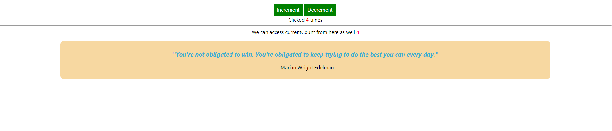

## Basic redux setup in react without saga 
### In this, I made an app where there are two buttons: one for increment and another for decrement.
### The redux state is used so the state can be accessed from another component.
### The structure can be scaled to have more reducers.

### For saga intergration on top of this check out `master` branch.

#### Extra thing by saga: here when the increment action is called, the action is intercepted by quotesSaga and a random quote is fetched and displayed.
- Screenshots
